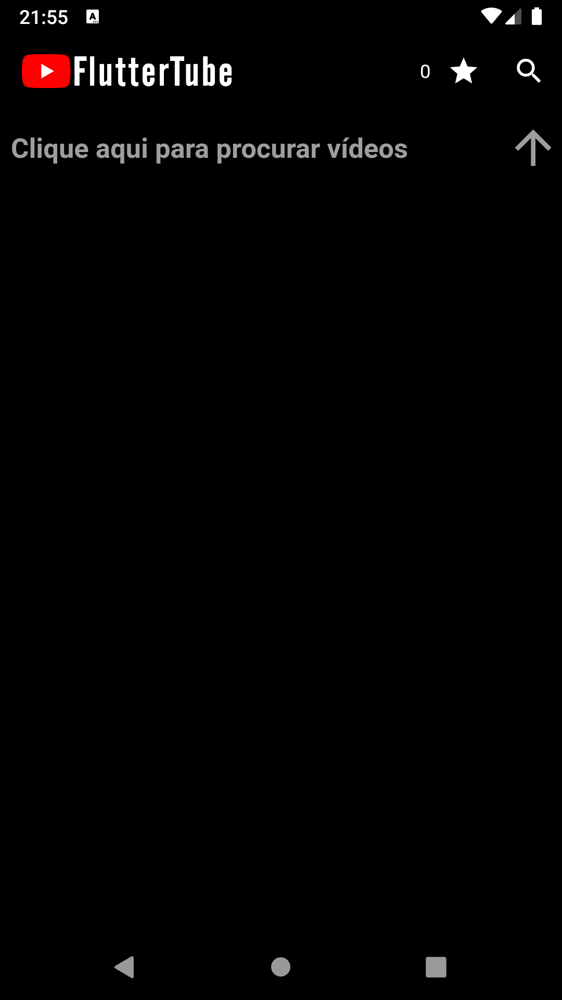
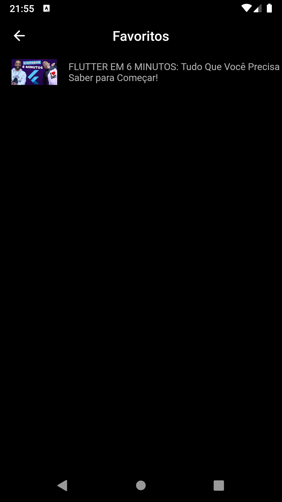

<h1 align="center">
  
  <br>
</h1>

<p align="center">
  
  
  
  
  
  
  
  
  
</p>

<h4 align="center">
  <p>Pequeno clone do YouTube.</p>
</h4>


<p align="center">
  |&nbsp;&nbsp;&nbsp;
  <a href="#tecnologias">Tecnologias</a>&nbsp;&nbsp;&nbsp;|&nbsp;&nbsp;&nbsp;
  <a href="#como-usar">Como usar</a>&nbsp;&nbsp;&nbsp;|&nbsp;&nbsp;&nbsp;
  <a href="#dependencias">Dependências</a>
  &nbsp;&nbsp;&nbsp;|
</p>

## Screenshots

<p align="center">
  
  
  
</p>

## Tecnologias

Projeto desenvolvido com as seguintes tecnologias:

- [Flutter][flut]

## Como usar 

Pegue a <i><b>API KEY</b></i> nesse link <a href="https://console.developers.google.com">console.developers.google.com</a><br />
Coloque sua <i><b>API KEY</b></i> no local que esta indicado no arquivo <i><b>apii.dart</b></i><br />
Altere o nome do arquivo <i><b>apii.dart</b></i> para <i><b>api.dart</b></i><br />
No terminal:

```bash
# Faça um clone deste repositório
$ git clone https://github.com/V1PERFX/fluttertube.git

# Entre no repositório
$ cd fluttertube

# Instale as dependências
$ flutter pub get

# Execute
$ flutter run
```

## Dependencias

Dependências que foi utilizada:

- flutter_youtube: ^2.0.0+1
- http: ^0.12.2
- shared_preferences: ^0.5.8
- rxdart: ^0.20.0
- bloc_pattern: ^1.3.0

---
<h4 align="center">
  Feito com :heart: por <a href="https://www.linkedin.com/in/v1perfx/">V1PERFX</a> 
</h4>

[flut]: https://flutter.dev/docs/get-started/learn-more